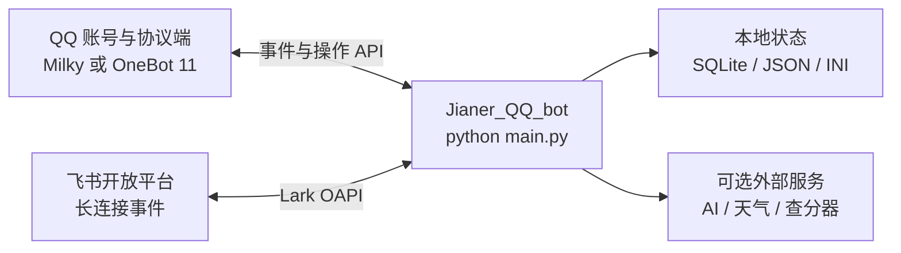

# 简儿 Jianer NEXT 4 原生部署教程

本文面向第一次部署本项目的维护者，覆盖 Windows 与 Debian/Ubuntu Linux。部署目标是：

- 启动一个 Jianer Bot 进程；
- 连接一个已经登录的 QQ 协议端（Milky 或 OneBot 11），或连接飞书开放平台；
- 正确保存本地配置、AI 密钥、SQLite 数据和插件状态；
- 在前台验收通过后，把进程交给 Windows 任务计划程序或 Linux `systemd` 常驻运行。

> [!CAUTION]
>
> 当前仓库的 `dev` 分支是 Canary 开发分支，README 已明确提示不应直接作为稳定生产版本使用。请先用测试账号、测试群和独立机器验收，再决定是否长期运行。QQ 协议端也不属于本仓库，账号登录与平台风控风险需要部署者自行评估。

## 1. 先理解部署结构

本项目本身不会登录 QQ。QQ 部署至少包含两个进程：协议端负责登录账号并提供 API，Jianer 负责业务逻辑和插件。



一次只在 `config.json -> protocol` 中启用一个协议。

| 协议 | 当前部署建议 | 连接方向 | 备注 |
| --- | --- | --- | --- |
| Milky | 推荐的 QQ 入口 | Jianer 主动连接协议端的 `ws://主机:端口/event`，操作走同地址 HTTP API | 支持 `auth` Bearer Token |
| OneBot 11 | 可用 | 默认使用正向 WebSocket，由 Jianer 主动连接协议端 | 当前 FWS 路径不注入 `token`/`auth`，只应放在本机回环、可信内网或 VPN 内 |
| 飞书 | 可用 | 推荐 `long_connection`，Jianer 主动连接飞书 | 无需开放公网回调端口 |
| Kritor | 不建议选择 | — | 当前 JianerCore 0.92.5 的 `KritorConnection` 仍会抛出 `NotImplementedError` |

## 2. 环境要求

### 2.1 必需组件

- Python 3.11 或 3.12。当前工作副本已用 Python 3.12.7 和 `jianer-bot` 0.92.5 验证；不建议首次部署直接使用尚未验证的 Python 3.13/3.14。
- Git。
- 能访问所选协议端和所用外部 API 的网络。
- 一个普通权限的专用系统账号。Linux 不要用 `root` 运行机器人。

### 2.2 完整功能所需组件

- Playwright Chromium：JianerAI 网页工具、HTML 信息卡和部分舞萌功能会使用。
- FFmpeg 与 FFprobe：JianerAI 读取语音、视频和抽取音轨时会使用。
- 中文字体：Linux 生成中文图片时推荐安装 Noto CJK 字体。
- MaimaiDX 静态资源：仅在需要舞萌图片功能时准备，见第 8 节。

如果只想先验证基础消息收发，可以暂不配置 AI、天气和舞萌外部服务；但依赖安装仍建议一次完成。

## 3. 获取代码

当前 Canary 工作分支是 `dev`：

```bash
git clone --branch dev --single-branch https://github.com/SRInternet-Studio/Jianer_QQ_bot.git
cd Jianer_QQ_bot
```

如果代码已经由发布包、同步工具或管理员放到服务器，只需进入包含 `main.py` 的项目根目录。

## 4. 安装系统依赖

### 4.1 Windows

安装 64 位 Python 3.11/3.12 和 Git，并确认 Python Launcher 能找到目标版本：

```powershell
py -0p
py -3.12 --version
git --version
```

需要音视频功能时安装 FFmpeg，并确保下面两条命令都能从同一个运行账号的 `PATH` 找到：

```powershell
ffmpeg -version
ffprobe -version
```

### 4.2 Debian/Ubuntu Linux

先确认发行版提供的 `python3` 是 3.11 或 3.12，再安装基础包：

```bash
python3 --version
sudo apt update
sudo apt install -y git python3 python3-venv python3-pip ffmpeg fonts-noto-cjk
```

如果 `python3 --version` 低于 3.11，请使用发行版为当前版本提供的 Python 3.11/3.12 软件包或受信任的软件源，不要用旧解释器继续安装。

## 5. 创建虚拟环境并安装 Python 依赖

不要把依赖直接装到系统 Python。以下命令都在项目根目录执行。

### 5.1 Windows PowerShell

```powershell
py -3.12 -m venv .venv
Set-ExecutionPolicy -Scope Process Bypass
.\.venv\Scripts\Activate.ps1
python -m pip install --upgrade pip
python -m pip install -r requirements.txt
python -m pip check
```

### 5.2 Linux

```bash
python3 -m venv .venv
source .venv/bin/activate
python -m pip install --upgrade pip
python -m pip install -r requirements.txt
python -m pip check
```

`requirements.txt` 当前允许安装 `jianer-bot>=0.92.5`，因此未来重新部署时可能得到比本教程验证版本更新的 JianerCore。每次验收都应记录实际版本：

```bash
python -c "import importlib.metadata as m; print(m.version('jianer-bot'))"
```

如果要保留一次已经验收通过的完整依赖快照，可在验收后执行 `python -m pip freeze`，把结果保存到部署记录中。不要用旧快照覆盖新提交声明的依赖范围。

### 5.3 安装 Playwright Chromium

Windows：

```powershell
python -m playwright install chromium
```

Debian/Ubuntu：先用管理员权限安装 Chromium 所需系统库，再以实际运行机器人的账号下载浏览器：

```bash
sudo .venv/bin/python -m playwright install-deps chromium
.venv/bin/python -m playwright install chromium
```

浏览器默认安装到运行账号的用户目录。以后由 `systemd` 使用 `jianer` 用户运行时，也必须让同一个 `jianer` 用户执行第二条安装命令，否则服务可能找不到 Chromium。

## 6. 创建主配置

先从脱敏模板复制，不要直接修改或提交模板：

Windows：

```powershell
Copy-Item config.example.json config.json
Copy-Item .env.example .env
```

Linux：

```bash
cp config.example.json config.json
cp .env.example .env
chmod 600 config.json .env
```

`config.json` 已被仓库忽略。编辑时至少核对这些字段：

| 字段 | 是否必填 | 含义与注意事项 |
| --- | --- | --- |
| `owner` | 是 | 至少放一个维护者 ID，不能保留空数组；当前启动代码会读取 `owner[0]` |
| `protocol` | 是 | `Milky`、`OneBot` 或 `Feishu`，大小写建议与模板一致 |
| `uin` | QQ 必填 | 机器人自己的 QQ 号；飞书可保留 `0` |
| `connections.<协议>` | 是 | 当前协议的连接参数 |
| `connection` | 是 | 兼容字段；建议完整复制当前活动连接，OneBot 尤其必须保持一致 |
| `others.ROOT_User` | 是 | 至少放一个可信根管理员；QQ 填 QQ 号，飞书填当前协议可发送私聊的用户 ID |
| `others.reminder` | 是 | 命令前缀，模板为 `~` |
| `others.bot_name` / `bot_name_en` | 是 | 机器人中英文名称 |
| `others.Auto_approval` | 是 | 入群邀请自动审批关键词；不需要时使用空数组 |
| `black_list` | 否 | 当前主要用于阻止指定群使用 JianerAI，不等于全局群黑名单 |
| `log_level` | 否 | 首次部署可用 `INFO`，排障时临时改为 `DEBUG` |

建议给 `others` 增加戳一戳回复，缺失时机器人只会记录“不接受戳一戳”：

```json
{
  "poke_rejection_phrases": [
    "不要一直戳我啦！"
  ]
}
```

> [!IMPORTANT]
>
> `connections` 是多协议配置表，而顶层 `connection` 是兼容字段。当前 OneBot 运行路径直接读取顶层 `connection`。切换到 OneBot 时，如果只改 `connections.OneBot`，机器人可能仍连接原来的 Milky 端口。

### 6.1 Milky 配置

Milky 是模板默认协议。把以下两处配置为同一组值：

- `connections.Milky`
- 顶层 `connection`

示例：

```json
{
  "mode": "HTTPC",
  "host": "127.0.0.1",
  "port": 3010,
  "listener_host": "127.0.0.1",
  "listener_port": 5003,
  "retries": 5,
  "auth": "replace-with-a-long-random-token"
}
```

同时设置：

```json
{
  "protocol": "Milky",
  "uin": 123456789
}
```

协议端需要在同一地址提供：

- WebSocket 事件流：`ws://127.0.0.1:3010/event`
- Milky HTTP 操作 API：同一个 `host:port`
- 与 `auth` 完全相同的 Bearer Token；如果协议端未启用鉴权，双方都留空

虽然配置名为 `HTTPC`，当前 Milky 适配器的事件仍由 Jianer 主动连接 WebSocket `/event`，`listener_host` 和 `listener_port` 不参与这条事件连接。

Milky 当前使用明文 `ws://` 与 `http://`。不要把端口直接暴露到公网；跨机器部署应放在可信内网、VPN 或受控隧道内，并配合防火墙和 `auth`。

### 6.2 OneBot 11 配置

推荐使用协议端提供的正向 WebSocket 服务。把 `connections.OneBot` 和顶层 `connection` 都设置为：

```json
{
  "mode": "FWS",
  "host": "127.0.0.1",
  "port": 5004,
  "listener_host": "127.0.0.1",
  "listener_port": 8081,
  "retries": 5,
  "token": null,
  "auth": null
}
```

同时设置：

```json
{
  "protocol": "OneBot",
  "uin": 123456789
}
```

协议端需要监听 `ws://127.0.0.1:5004`，Jianer 会主动连接它。

当前 JianerCore 0.92.5 的 OneBot FWS 构造路径没有把 `token` 或 `auth` 传给 WebSocket 连接。因此：

- 首选同机 `127.0.0.1`；
- 跨机器时使用可信内网、VPN 或隧道；
- 不要为了绕过鉴权而把无 Token 的 OneBot WebSocket 暴露到公网。

### 6.3 飞书长连接配置

先在飞书开放平台创建企业自建应用，启用机器人能力，选择长连接接收事件，订阅消息接收事件，并按控制台提示授予收发消息所需权限。应用必须在目标租户内发布或可用。

设置：

```json
{
  "protocol": "Feishu",
  "uin": 0
}
```

在 `connections.Feishu` 中填写：

```json
{
  "mode": "HTTPC",
  "host": "0.0.0.0",
  "port": 8081,
  "listener_host": "0.0.0.0",
  "listener_port": 8081,
  "retries": 5,
  "auth": "",
  "event_mode": "long_connection",
  "app_id": "cli_xxxxxxxxxxxxxxxx",
  "app_secret": "replace-me",
  "verification_token": "",
  "encrypt_key": "",
  "callback_path": "/feishu/callback",
  "base_url": "https://open.feishu.cn",
  "token_refresh_skew_seconds": 300,
  "bot_open_id": ""
}
```

再把同一对象复制到顶层 `connection`，减少其它兼容代码读取到错误协议配置的机会。

长连接模式至少要求 `app_id` 和 `app_secret`。`verification_token`、`encrypt_key` 和 HTTP 回调端口主要用于 webhook；使用 `long_connection` 时不需要把 `8081` 暴露到公网。已知机器人 Open ID 时建议填写 `bot_open_id`，否则可先留空完成基础连接验收。

## 7. 配置 JianerAI

JianerAI 从 `aiconfig/*.ai.json` 读取模型，不以 `config.json` 里旧的 `gemini_key`、`openai_key` 或 `deepseek_key` 作为当前模型注册来源。

不要直接使用仓库中的 `aiconfig/example.ai.json`：它只是字段示例。新建例如 `aiconfig/primary.ai.json`：

```json
{
  "FriendlyName": "主模型",
  "Model": "your-model-id",
  "ResponseType": "OpenAI Chat Completions",
  "ApiKey": "replace-with-real-api-key",
  "BaseUrl": "https://your-provider.example/v1",
  "Temperature": 0.7,
  "MaxTokens": 2000,
  "ToolsEnabled": "auto"
}
```

可用的 `ResponseType`：

| 值 | 使用的协议 |
| --- | --- |
| `OpenAI Chat Completions` | OpenAI 兼容 Chat Completions |
| `OpenAI Responses` | OpenAI Responses API |
| `Google GenerateContent` | Google GenAI SDK |
| `Anthropic Messages` | Anthropic Messages API |

文件名去掉 `.ai.json` 后就是模型代码。上例的代码是 `primary`，因此在 `config.json -> others` 中设置：

```json
{
  "default_mode": "primary",
  "memory_mode": "primary"
}
```

Linux 上收紧模型文件权限：

```bash
chmod 600 aiconfig/*.ai.json
```

常用可选设置：

```json
{
  "memory_enabled_default": true,
  "jianer_ai_db_path": "jianer_ai.db",
  "agent_enabled_default": true,
  "agent_browser_enabled": true,
  "agent_allowed_tools": [
    "get_current_time",
    "calculate_expression"
  ]
}
```

`agent_allowed_tools` 一旦配置就是显式白名单；未列出的工具不会提供给模型。若不需要网页浏览，把 `agent_browser_enabled` 设为 `false`，可以减少运行面，但舞萌或其它制图功能仍可能需要 Chromium。

### 7.1 `.env` 与系统环境变量的区别

当前代码会由 MaimaiDX 和 QWeather 主动读取仓库根目录 `.env`。部分 JianerAI 工具则直接读取进程环境：

- `DDGS_BACKEND`：网页搜索后端，当前默认 `yandex`；
- `GITHUB_TOKEN`：提高 GitHub API 限额或访问令牌已授权的仓库；
- QWeather 与 MaimaiDX 变量：可直接写在 `.env`，字段见 `.env.example`。

Linux `systemd` 示例会把 `.env` 同时作为 `EnvironmentFile` 加载，因此其中的通用环境变量也能进入机器人进程。Windows 如果只把变量写入 `.env`，只有明确读取 `.env` 的插件能看到；其它变量应配置到运行账号的系统环境，设置后重新启动任务。

## 8. 可选插件资源

### 8.1 MaimaiDX

完整舞萌功能需要把上游静态资源放到：

```text
data/maimaidx/static/
├── font/
├── mai/pic/
├── mai/cover/
├── mai/shougou/
└── mai/plate_version/
```

还必须存在 `mai/cover/0.png`。若 `.env` 中 `ASSETS_ONLINE=false`，还要提供 `mai/plate/`。

默认状态目录是：

```text
data/maimaidx/private/
```

其中可能包含 OAuth Token 和玩家设置，必须备份并限制权限。Windows 上 Token 使用当前服务账号的 DPAPI 加密，因此不要随意更换运行账号；换账号后旧密文可能无法解密。

相关 `.env` 字段已在 `.env.example` 中列出。更完整的资源、查分器与落雪 OAuth 说明见 [plugins/MaimaiDX/README.md](plugins/MaimaiDX/README.md)。

如果暂时完全不需要某个插件，可按项目约定给文件或目录添加 `d_` 前缀后再启动。注意 MaimaiDX 依赖 JianerAI；禁用 JianerAI 时也要禁用 MaimaiDX，否则依赖检查会失败。

### 8.2 QWeather

需要天气工具时，在 `.env` 中配置：

```dotenv
QWEATHER_API_HOST=your-api-host.qweatherapi.com
QWEATHER_PROJECT_ID=your-project-id
QWEATHER_CREDENTIAL_ID=your-credential-id
QWEATHER_PRIVATE_KEY_PATH=secrets/qweather-ed25519-private.pem
```

私钥必须是 PKCS#8 PEM 格式的 Ed25519 私钥。相对路径从仓库根目录解析。Linux 建议：

```bash
chmod 700 secrets
chmod 600 secrets/*
```

## 9. 启动前检查

### 9.1 校验 JSON

Windows：

```powershell
python -m json.tool config.json > $null
Get-ChildItem aiconfig -Filter *.ai.json | ForEach-Object {
    python -m json.tool $_.FullName > $null
}
```

Linux：

```bash
python -m json.tool config.json >/dev/null
for file in aiconfig/*.ai.json; do
    python -m json.tool "$file" >/dev/null
done
```

### 9.2 校验依赖与插件装载

Windows：

```powershell
python -m pip check
$env:PYTHONPATH = (Get-Location).Path
python -c "from jianer.plugins import PluginManager; r=PluginManager().load_plugins('plugins'); assert not r.failed, r.failed; print(f'loaded={len(r.loaded)} warnings={len(r.warnings)}')"
```

Linux：

```bash
python -m pip check
PYTHONPATH="$PWD" python -c "from jianer.plugins import PluginManager; r=PluginManager().load_plugins('plugins'); assert not r.failed, r.failed; print(f'loaded={len(r.loaded)} warnings={len(r.warnings)}')"
```

这一步只证明 Python 依赖和插件静态装载成功，不证明 QQ/飞书、AI、查分器、天气或真实消息发送已经可用。

## 10. 第一次前台启动与真实验收

先启动协议端并完成账号登录，再在项目根目录运行：

```bash
python main.py
```

Windows 未激活虚拟环境时也可以显式运行：

```powershell
.\.venv\Scripts\python.exe main.py
```

Linux 未激活虚拟环境时：

```bash
.venv/bin/python main.py
```

观察日志，至少确认：

1. JianerCore 启动且版本符合部署记录；
2. 插件加载结果中没有 `failed`；
3. 日志出现所选协议连接成功，而不是不断 `ConnectionRefusedError` 或重试耗尽；
4. 在真实私聊或测试群发送 `~帮助`，机器人能回复；
5. 如果启用 AI，群内明确 `@机器人 + 问题`，确认模型真实返回；
6. 如果启用图片、语音、视频或舞萌，分别做一次真实媒体发送与接收；
7. 用 `Ctrl+C` 停止，确认插件关闭流程没有持续报错。

只有完成第 4 步以后，才能称为协议端到端验收；模型、媒体和第三方插件需要各自的真实验收，不能用“插件加载成功”代替。

## 11. 常驻运行

### 11.1 Linux `systemd`

推荐使用专用账号 `jianer`，并把项目放在 `/opt/jianer/Jianer_QQ_bot`。下面假设代码、虚拟环境、配置和 Chromium 都已经由该账号准备完成：

```bash
sudo chown -R jianer:jianer /opt/jianer/Jianer_QQ_bot
```

创建 `/etc/systemd/system/jianer-bot.service`：

```ini
[Unit]
Description=Jianer NEXT 4 Bot
Wants=network-online.target
After=network-online.target

[Service]
Type=simple
User=jianer
Group=jianer
WorkingDirectory=/opt/jianer/Jianer_QQ_bot
Environment=PYTHONUNBUFFERED=1
Environment=PYTHONDONTWRITEBYTECODE=1
Environment=TZ=Asia/Shanghai
EnvironmentFile=-/opt/jianer/Jianer_QQ_bot/.env
ExecStart=/opt/jianer/Jianer_QQ_bot/.venv/bin/python /opt/jianer/Jianer_QQ_bot/main.py
Restart=on-failure
RestartSec=5
KillSignal=SIGINT
TimeoutStopSec=90
UMask=0077
NoNewPrivileges=true
PrivateTmp=true

[Install]
WantedBy=multi-user.target
```

如果实际路径或账号不同，必须同步修改 `User`、`Group`、`WorkingDirectory`、`EnvironmentFile` 和 `ExecStart`。

加载并启动：

```bash
sudo systemctl daemon-reload
sudo systemctl enable --now jianer-bot
sudo systemctl status jianer-bot
```

查看实时日志：

```bash
sudo journalctl -u jianer-bot -f
```

常用操作：

```bash
sudo systemctl restart jianer-bot
sudo systemctl stop jianer-bot
sudo systemctl start jianer-bot
```

`KillSignal=SIGINT` 给主程序机会执行 `finally` 中的插件关闭流程；`TimeoutStopSec=90` 大于当前插件关闭等待时间。

### 11.2 Windows 任务计划程序

先以前台方式完成第 10 节验收。随后在“以管理员身份运行”的 PowerShell 中，可用任务计划程序在登录时启动：

```powershell
$Repo = (Resolve-Path .).Path
$UserId = [System.Security.Principal.WindowsIdentity]::GetCurrent().Name
$Python = Join-Path $Repo ".venv\Scripts\python.exe"

$Action = New-ScheduledTaskAction `
    -Execute $Python `
    -Argument "main.py" `
    -WorkingDirectory $Repo
$Trigger = New-ScheduledTaskTrigger -AtLogOn -User $UserId
$Principal = New-ScheduledTaskPrincipal `
    -UserId $UserId `
    -LogonType Interactive `
    -RunLevel Limited
$Settings = New-ScheduledTaskSettingsSet `
    -StartWhenAvailable `
    -RestartCount 5 `
    -RestartInterval (New-TimeSpan -Minutes 1) `
    -ExecutionTimeLimit ([TimeSpan]::Zero) `
    -MultipleInstances IgnoreNew

Register-ScheduledTask `
    -TaskName "JianerBot" `
    -Description "Jianer NEXT 4 Bot" `
    -Action $Action `
    -Trigger $Trigger `
    -Principal $Principal `
    -Settings $Settings
```

手动控制和查看最近结果：

```powershell
Start-ScheduledTask -TaskName "JianerBot"
Get-ScheduledTaskInfo -TaskName "JianerBot"
Stop-ScheduledTask -TaskName "JianerBot"
```

此示例在当前用户登录后运行。需要无人登录也自动运行时，可在任务计划程序图形界面改为“无论用户是否登录都要运行”，并为专用账号配置凭据。MaimaiDX 的 Windows DPAPI 数据与运行账号绑定，前台验收和计划任务必须使用同一账号。

任务计划程序不适合直接观察控制台日志。首次部署或排障时先停止计划任务，再在项目根目录前台运行；不要同时启动两个机器人进程。

## 12. 数据、权限与备份

建议停止机器人后再做一致性备份。尤其是 SQLite 正在使用 WAL 模式时，不要只复制主 `.db` 文件而忽略同名 `-wal` 和 `-shm`。

| 路径 | 内容 | 备份建议 |
| --- | --- | --- |
| `config.json` | 主协议、管理员和运行设置 | 必须 |
| `.env` | 天气、舞萌及可选环境变量 | 必须 |
| `aiconfig/*.ai.json` | 模型端点与 API Key | 必须，排除公开示例亦可 |
| `secrets/` | QWeather 等私钥 | 必须 |
| `jianer_ai.db*` | AI 会话、记忆和状态 | 必须；停机复制整组文件 |
| `data/maimaidx/private/` | 舞萌用户数据库和 OAuth Token | 使用 MaimaiDX 时必须 |
| `data/jianer_browser/` | Agent 浏览器 profile 与审计日志 | 需要保留登录态或审计记录时备份 |
| `Super_User.ini` / `Manage_User.ini` | 动态管理员名单 | 必须 |
| `feishu_bindings.json` | 飞书与 QQ 身份绑定 | 使用飞书时必须 |
| `help_mode_settings.json` | 用户帮助显示偏好 | 建议 |
| `like_data.json` | 点赞插件状态 | 建议 |
| `suffix_config.json` | JianerAI 后缀 | 使用时必须 |
| `prerequisites/` | 当前人设和自定义人设模板 | 修改人设时必须 |
| `data/maimaidx/static/` | 大型舞萌静态资源 | 可重新取得时可不备份，否则建议 |

这些文件大多已被 Git 忽略；“`git status` 看不到”不等于“不需要备份”。

Linux 建议让项目和所有运行时文件归 `jianer` 用户所有，并保持密钥文件为 `0600`、密钥目录为 `0700`。不要用管理员账号运行后再切换到普通账号，否则数据库、临时目录或浏览器 profile 可能因所有权错误而无法写入。

## 13. 上线前安全检查

1. 不要提交 `config.json`、`.env`、真实 `aiconfig/*.ai.json`、数据库、私钥或 `data/`。
2. OneBot/Milky 端口不要直接暴露到公网；优先同机回环地址，其次可信内网或 VPN。
3. 使用独立低权限系统账号，Linux 账号不要有 `sudo` 权限。
4. `plugins/RunCommand` 默认启用，它允许 `ROOT_User`/`Super_User` 从群聊执行服务器命令。若不需要，应按 `d_` 前缀约定禁用；若保留，必须严格保护管理员账号，并继续让机器人运行在低权限系统账号下。
5. 不要把真实 API Key 打到截图、Issue、日志片段或群聊里。
6. 只开放实际需要的 Agent 工具；涉及网页、网络或写操作的工具应使用 `agent_allowed_tools` 显式白名单。
7. 同一份 SQLite 状态只运行一个 Jianer 主进程。重复启动会导致事件重复消费、重复回复和数据库争用。

## 14. 更新流程

以 Linux `systemd` 为例：

```bash
sudo systemctl stop jianer-bot
cd /opt/jianer/Jianer_QQ_bot
git status --short
git rev-parse HEAD
git pull --ff-only origin dev
source .venv/bin/activate
python -m pip install -r requirements.txt
python -m playwright install chromium
python -m pip check
PYTHONPATH="$PWD" python -c "from jianer.plugins import PluginManager; r=PluginManager().load_plugins('plugins'); assert not r.failed, r.failed"
sudo systemctl start jianer-bot
sudo journalctl -u jianer-bot -n 100 --no-pager
```

更新前先做第 12 节的停机备份，并记录 `git rev-parse HEAD`。如果 `git status --short` 出现跟踪文件改动，不要直接覆盖或强制重置；先确认这些改动是否属于本机部署定制，再决定如何合并。

Windows 更新时同样遵循：停止任务 → 备份 → `git status` → `git pull --ff-only` → 更新依赖和 Chromium → 前台验收 → 恢复计划任务。

## 15. 常见故障

### 启动时报 `IndexError: list index out of range`

首先检查 `config.json -> owner`。模板为了脱敏使用空数组，但运行时会读取 `owner[0]`；至少填一个维护者 ID。

### 找不到 `config.json`

确认 `config.json` 与 `main.py` 位于同一项目根目录，并且是从 `config.example.json` 复制而来。不要只把工作目录切到其它位置后直接复制一个孤立的 `main.py`。

### 协议连接一直被拒绝

- 先确认协议端已经登录并启动 API；
- 核对协议类型、主机和端口；
- Milky 确认 `/event` WebSocket 可用且 `auth` 一致；
- OneBot 确认协议端提供的是正向 WebSocket；
- 确认本机防火墙或安全组没有阻断可信内网流量；
- 不要把 `127.0.0.1` 当成另一台机器的地址。

### 切换 OneBot 后仍连接 Milky 端口

把顶层 `connection` 完整改成与 `connections.OneBot` 相同。当前 OneBot 路径直接读取顶层兼容字段。

### Milky 返回 401/403

检查 Jianer 的 `auth` 与协议端 Token 是否逐字一致。两端一方留空、另一方启用鉴权也会失败。

### AI 显示模型不存在或请求发往错误端点

- 确认文件名是 `aiconfig/<代码>.ai.json`；
- `default_mode` 与 `memory_mode` 应等于文件名中的 `<代码>`；
- 用 `python -m json.tool` 校验 JSON；
- 核对 `ResponseType`、`Model`、`BaseUrl` 和 `ApiKey`；
- 不要把 `aiconfig/example.ai.json` 当成真实模型配置。

### Playwright 提示浏览器不存在

使用实际运行机器人服务的同一账号执行：

```bash
.venv/bin/python -m playwright install chromium
```

Linux 若缺系统库，再执行 `sudo .venv/bin/python -m playwright install-deps chromium`。

### 语音或视频提示服务器未安装 FFmpeg

确认 `ffmpeg -version` 与 `ffprobe -version` 都能在服务账号环境中运行。交互式终端能找到不代表 `systemd` 或任务计划程序一定继承了相同 `PATH`。

### 中文图片显示方块或空白

Linux 安装 `fonts-noto-cjk` 并重启服务。MaimaiDX 还需要自己的 `data/maimaidx/static/font` 资源，系统字体不能替代全部插件字体。

### MaimaiDX 提示静态资源不完整

根据日志列出的缺失路径补齐 `data/maimaidx/static`，并核对 `.env -> MAIMAIDX_PATH`。只安装 Python 依赖不会自动得到上游大型静态资源。

### SQLite 或目录 `Permission denied`

停止服务，确认项目目录、`data/`、`jianer_ai.db*`、`prerequisites/` 和浏览器 profile 都归服务账号所有。不要同时以 `root`、普通用户和计划任务账号轮流启动同一份数据。

### 机器人收到消息但不回复 AI

群聊中的 JianerAI 默认要求明确 `@机器人`。同时检查：

- 群是否在 `black_list`；
- 模型配置是否真实可用；
- 当前模型是否支持配置的工具；
- 日志中是否有 provider、媒体解析或工具调用错误。

## 16. 部署验收清单

- [ ] 使用 Python 3.11/3.12 的独立虚拟环境
- [ ] `python -m pip check` 通过
- [ ] `config.json` JSON 校验通过，`owner` 与 `ROOT_User` 非空
- [ ] 当前协议的 `connections.<协议>` 与顶层 `connection` 已核对
- [ ] `aiconfig` 中只有示例和受保护的真实配置，模型代码与 `default_mode` 一致
- [ ] 插件装载检查无 `failed`
- [ ] 协议端真实连接成功
- [ ] 私聊或测试群 `~帮助` 真实回复成功
- [ ] 所启用的 AI、图片、语音、视频、天气、舞萌功能分别做过真实验证
- [ ] 只运行一个主进程
- [ ] 常驻服务使用低权限专用账号
- [ ] 密钥、SQLite 和插件私有数据已纳入停机备份
- [ ] 已记录 Git 提交、Python 版本和 JianerCore 版本
